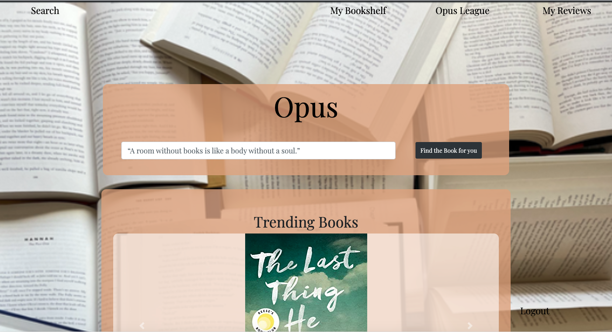
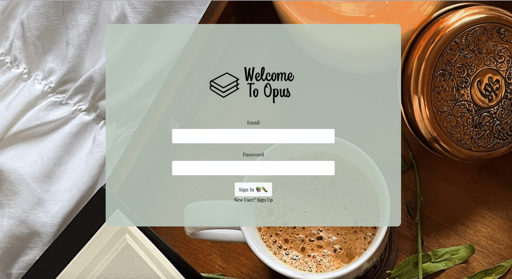

#  Opus

## Description 

Opus was created with readers in mind, rather than dollar signs and ad space like so many other reading applications promote. Opus allows the user to create a unique login, search for books and add them to their shelves. Additionally, Opus League provides readers a book club experience, the League page shows other members reviews and ratings. Future development, would allow members to submit "League Worthy Reads" and create their own club - no spoilers, please! Opus uses MySQL2 & Sequelize to store all books, users and usersbooks - books are pulled from APIs to Google Books and NYT Top Trending and users can safely sign up and login using Passport & Bcrypt.

---

## User Story

* **As a** reader, 
* **I want** a user friendly book app that allows for customization and interaction,
* **So I** can be presented with new books and interact with like minded readers.

---

## Development 

Opus follows MERN stack development, using MySQL2, Express, React and Node. The foundation of the app was built using create-react-app, client side development continued from this point with most files living in the src folder through components and pages. Server side was created with Express, Sequelize-cli, Sequelize and MySQL2 - data is stored locally in the MySQLWorkbench. Concurrently allows users to run both client and server side from the command line and provides live updates with changes when running properly.

 - Client Development:
     -  Components
        - Variety of reusable pieces created 
        - BookCard, BookDisplay, Carousel, List, Login, NavBav
     - Pages
        - Browser pages crafted using various components as well as JavaScript & HTML practices
        - React imported for all pages, useContext, useEffect or useState applied 
        - Browser view  
    -  MySQL Database  
         - Models created for Users, Books and UsersBooks
         - MySQLWorkbench used to monitor data
         - UsersBooks joins using userID and BookID
    - Notable NPM packages
        - Client side: react-bootstrap, react-strap, react-tooltip & simple-star-rating
        - Server side: bcrypt, concurrently, mysql2, passport + passport local & sequelize 
        - See package.json for all packages
 

---

## Installation 

NPM install for all necessary packages - other files required throughout the app once they are created. Ensure these are listed on package.json as dependencies. MySQLWorkbench required for database. Use preferred browser viewer.

--- 

## Preview 

---

## Heroku Link 

---

## Github Link

https://github.com/Teangelo1/Opus

--

## Credits

Developers - Jacqueline Ross, Victoria Shulman, Robert Sunde & Teangelo Burks

